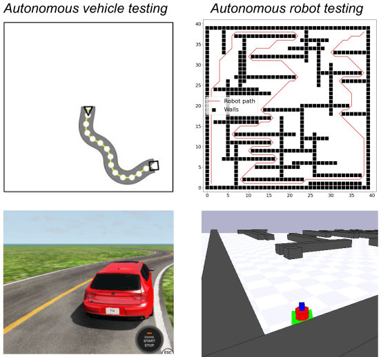

<p align="center">
	
</p>
<h1 align="center">
	AmbieGen Autonomous System Testing Framework
</h1>

<p align="center">
  <b>Current Framework Version: 0.1.0</b>
</p>

The framework, along with some initial results, is covered in the paper [A search-based framework for automatic generation of testing environments for cyber–physical systems](https://www.sciencedirect.com/science/article/pii/S0950584922000866). This paper should be cited if code from this project is used in any way:
```
@article{HUMENIUK2022106936,
title = {A search-based framework for automatic generation of testing environments for cyber–physical systems},
journal = {Information and Software Technology},
volume = {149},
pages = {106936},
year = {2022},
issn = {0950-5849},
doi = {https://doi.org/10.1016/j.infsof.2022.106936},
author = {Dmytro Humeniuk and Foutse Khomh and Giuliano Antoniol}
}
```
## Installation
1. Clone this repository to your local machine.
2. To install the dependencies needed to use the project, run `pip install -r requirements.txt` from inside the repository folder. 
3. Now AmbieGen is ready to use. Check the [following section](https://github.com/dgumenyuk/AmbieGen_tool#usage) on how to use it.

## Usage
1. You can start the test case generation process by running from inside the repository: 
```
python optimize.py
``` 
2. Before running the script, you may want to change the paramenters of the problem, such as the type of the system under test, the algorithm to use and the number of runs to perform. To do so, you can change the input parameters of the `main` function in the `optimize.py` file.
You can also change the parameters of optimization algorithm as well as the parameters of your problem and the system under test in the ```config.py``` file.  
Here's of how to configure the tool to run the test case generation for autonomous robot using the NSGA-II algorithm:
```python
problem = "robot"
algo = "nsga2"
runs_number = 3
if __name__ == "__main__":
    main(problem, algo, runs_number)
```
3. Running the script will start the search algorithms for test case generation and provide the output of the search process in the form of the number of evaluations done, constraint violations and best solutions found.
4. At the output, a test suite of the 30 test cases will be generated and saved in the configured folder in the ```config.py``` file. The additional information about the test suite, such as the fitness of each test case, the average diversity of the solutions as well as well as the convergence of the solutions found will also be saved.
5. More information about the avalable options can be found in the [next section](https://github.com/dgumenyuk/AmbieGen_tool#options).

## Options and parameters
1. In the ```optimize.py``` file you can specify the system under test, the algorithm to use and the number of runs to perform. 
Currently AmbieGen supports the following systems under test:
- ```robot``` - autonomous robot, naviagting in a closed room with obstacles. Obstacles are represented as vertical and horizontal walls.
- ```vehicle``` - autonomous vehicle that is driving on two lane road. The goal is to test the vehicle Lane Keeping Assist System (LKAS) to ensure that the vehicle stays in the lane given a valid road topology.  

To set one of the systems under test, you can change the ```problem``` variable in the ```main``` function:

AmbieGen also supports the following algorithms:
- ```ga``` - a singe-objective genetic algorithm, where the fitness is defined by the performace of the simplified model of the system under test on a given test case. The worse the performance, the better the fitness.
- ```nsga2``` - a multi-objective genetic algorithm, where the first fitness function is defined by the performace of the simplified model of the system under test on a given test case and the second - by diversity of the test case, compared to the diversity of the 5 best solutions found.

The implementation of these algorithms is based on the [Pymoo framework](https://pymoo.org/).

To set one of the systems under test, you can change the ```algo``` variable in the ```main``` function.

Finally, you can set the number of runs to perform by changing the ```runs_number```.   

2. In the ```config.py``` file you can specify the parameters of algorithm in the ```ga``` section, as in the example:
```python
ga = {"pop_size": 50, "n_gen": 50, "mut_rate": 0.4, "cross_rate": 1}
```
Here the ```population size``` is set to 50, the ```number of generations``` to 50, the ```mutation rate``` to 0.4 and the ```crossover rate``` to 1.

In the ```vehicle_env``` and ```robot_env``` sections you can specify the parameters of the system under test, such as the map size, the minimal and the maximal possible values of the attributes. An important parameter is ```elem_types``` which is used to calculate the novelty. It specifies the number of environmental elements types. For example, for autonomous vehicle we have 3 types of road segments: straight, left and right. So the ```elem_types``` is set to 3. For the robot we only have two types of elements: walls and empty space. So the ```elem_types``` is set to 2.

In the ```files``` section you can specifies the folders to save the output files such as the statistics about the generated test cases (```stats_path```), the generated test cases (```tcs_path```) and the images of the generated test cases (```images_path```).